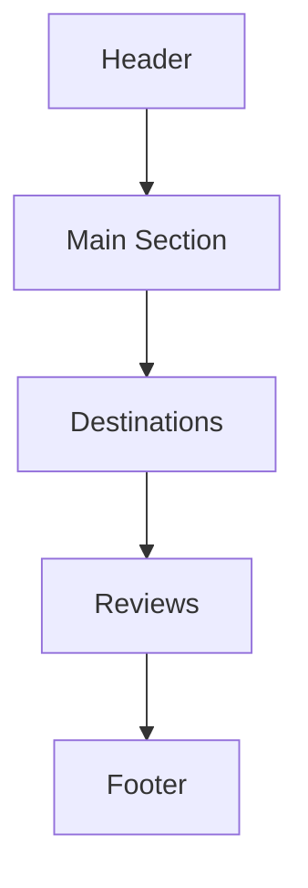

# Travel Planning Project - README

Welcome to the **Travel Planning** project! This project is designed to give users a seamless experience in planning their travel itineraries with personalized options and a visually appealing interface. Below, you'll find a guide on the project's structure and how each part contributes to a user-friendly travel planning website.

## Project Overview

This project is a **travel planning web page** created using **HTML, CSS (with Tailwind CSS), and Font Awesome** for styling and iconography. The webpage lets users browse destinations, enter their travel details, and request personalized itineraries effortlessly. Designed with beautiful visuals, it’s intuitive and easy to navigate, making trip planning smooth for everyone.

## Features

1. **Header with Logo & Search** - A search bar and a button to initiate a trip plan. Users can quickly search destinations.
2. **Dynamic Main Section** - Eye-catching hero section with travel information, a search form for itinerary customization, and key benefits (e.g., personalized itineraries, affordable bookings).
3. **Destinations Showcase** - Display of popular Indian travel destinations with booking options for easy selection.
4. **Reviews Section** - Testimonials from past users, enhancing credibility and user trust.
5. **Footer with Company Info** - Links to popular travel destinations, company information, contact details, and policies.

## Code Explanation

### HTML Structure

The code is structured into different sections to create a modular and organized layout:

- **Header**:
  - Contains the **logo** and **search bar**, giving users the ability to search destinations quickly.
  - The "Create a Trip" button initiates itinerary planning.
  
- **Main Section**:
  - The main content introduces the platform and encourages users to explore travel options with highlighted features such as "Free Personalised Itineraries" and "Zero Hidden Charges."
  - **Hero Section**: An overlay with background images that promotes effortless travel planning.
  - **Booking Form**: This form collects user input on travel preferences like destination, date, and options for itinerary personalization.
  
- **Destination Cards**:
  - **Featured Destinations**: Displays destinations (Kashmir, Uttarakhand, and Sikkim) as cards, with pictures and descriptions. Each card has a "Book Now" button to encourage further engagement.

- **Reviews**:
  - User testimonials are presented with user photos and feedback, providing social proof.

- **Footer**:
  - Contains important **company information**, including travel styles, policies, and contact details.
  
### CSS and Styling

- **Tailwind CSS**: 
  - The project uses Tailwind CSS for responsive and fast styling, ensuring consistency and mobile responsiveness.
  - Custom styles like button colors (`bg-yellow-500`), text sizes, and flex layouts are used for alignment.
  
- **Font Awesome**:
  - Font Awesome icons (e.g., map marker, calendar, rupee sign) visually enhance the key benefits section and other parts of the interface.

### How It Works

1. **User Interaction**: The user lands on the homepage with a visually appealing hero section, easy-to-use search bar, and clearly defined options for creating trips.
2. **Travel Details Entry**: Users enter trip details, select destinations, and submit the form to receive a customized travel plan.
3. **Browse Destinations**: Users can explore featured destinations and book trips directly.
4. **Footer Access**: The footer provides essential links, helping users navigate to other sections like Terms of Service and contact information.

### Diagrams 


1. **Header** – Logo, Search bar, and "Create a Trip" button.
2. **Main Section** – Hero image, key features, booking form.
3. **Destinations** – Grid layout with destination cards.
4. **Reviews** – Testimonial cards.
5. **Footer** – Links to company information and policies.



## Getting Started

### Prerequisites

- Basic knowledge of HTML, CSS (Tailwind CSS), and using an IDE (like VSCode).
- Optional: Knowledge of JavaScript to add interactivity.

### Usage Instructions

1. **Clone the Repository**:
   ```
   git clone https://github.com/abhishekpa8368/travel-agency
   ```
   
2. **Open the Project**:
   - Open the `index.html` file in any web browser to view the project.
   
3. **Editing and Customizing**:
   - Update the travel destinations, images, or other text as needed.
   - You can also add additional sections as the project grows.

---

### Conclusion

The **Travel Planning** project is a user-friendly website aimed at making travel itinerary planning simple and enjoyable. From browsing destinations to getting personalized plans, this website is your all-in-one solution for hassle-free travel planning. Enjoy your trip with **The Tarzan Way**!
